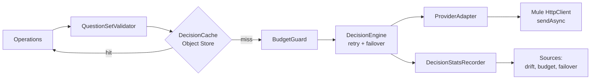

# Jev Mule 4 Connector — Implementation Plan

Sep 25, 2026 · @Amir Khan

## 1. Handover brief

Build a Mule 4 Java SDK connector, **Jev Connector** (XML prefix `jev`), that calls TypeSafe's Jev decision model through five interchangeable routes and returns typed, chainable decisions to Mule flows. Target: Java 17, Mule SDK 1.12 forward-compatible build, first release `1.0.0`.

Jev is not a chat model. It takes a `state` plus named typed questions (Noul = yes/no probability, Choice = option + distribution, Score = ordered rubric) and returns one typed answer per question. The connector's job is to make those answers first-class Mule values that drive Choice routers, Batch filters, error handlers and follow-up calls.

**How to use this plan (for the implementing agent)**

1. Read sections 2–3 before writing code; they record what was verified on 2026-09-25 and what was not.
2. Implement in the milestone order of section 15. Each milestone ends green: `mvn clean verify` passes, including formatter and import checks.
3. Where the reference connectors (Inference, Bedrock) and the Mule SDK 1.12 docs disagree, **the SDK docs win**. Section 2 lists each known deviation.
4. Never invent a provider field. If a wire detail in section 3 is marked *verify*, confirm it with a live call or official doc and record the result in `docs/provider-contracts.md` before coding against it.
5. Stop and ask the owner before: adding a runtime dependency not listed in section 5, changing the canonical data model (section 7), or dropping a provider from v1.

**Fixed decisions**

| Item | Value |
| --- | --- |
| Extension name | `Jev` (display: "Jev Connector") |
| XML prefix / namespace | `jev` / `http://www.mulesoft.org/schema/mule/jev` |
| Maven coordinates | `com.mulesoft.connectors:mule4-jev-connector` |
| Java package root | `com.mulesoft.connectors.jev` with `api` (public types) and `internal` (everything else) |
| Category | `Category.SELECT` (same as both references) |
| License | Apache-2.0 (same as Inference Connector) |
| Min Mule version | 4.9.0 (Java 17 floor; see section 5) |

**Out of scope for v1:** text generation, streaming responses (Jev returns one JSON object), OAuth flows, Netlify (it is an SDK-in-function route, not an HTTP API).

## 2. Findings from the SDK docs and reference connectors

Both reference connectors were cloned and read on 2026-09-25. They are good templates for project shape and conventions, but both predate SDK 1.12's forward-compatibility model and each breaks at least one current "must" rule for HTTP connectors.

**Mule SDK 1.12 (current docs)**

- New modules should use the `mule-java-extension-parent` parent (1.11.0 or later) and the bundled `org.mule.sdk.api` namespace, which decouples SDK version from the minimum Mule version. The archetype sets `min.mule.version` to 4.11.0 by default ([forward compatibility setup](https://docs.mulesoft.com/mule-sdk/latest/forward-compatibility-setup)).
- HTTP connectors **must** use the Mule HTTP client, created and started in the connection provider's `start()` and stopped in `stop()`; the provider must be a `CachedConnectionProvider` implementing `Startable`/`Stoppable`; the client name must derive from `@RefName`; operations must be non-blocking; proxy config and a configurable timeout are mandatory; HTTPS must be supported. The recommended client is `org.mule.sdk.api.http.HttpService.client(...)` with `sendAsync` ([HTTP-based connectors](https://docs.mulesoft.com/mule-sdk/latest/http-based-connectors)).
- Custom icon: `icon/icon.svg` at the project root; it appears in Exchange and Studio ([getting started](https://docs.mulesoft.com/mule-sdk/latest/getting-started)).
- From 2026-08-01, Exchange publication needs Java compatibility metadata: keep `@JavaVersionSupport` and use `mule-extensions-maven-plugin` 1.9.0 or later ([publishing](https://docs.mulesoft.com/mule-sdk/latest/publishing-connectors-exchange)).

**What to copy, what to change**

| Aspect | [Inference Connector](https://github.com/MuleSoft-AI-Chain-Project/mule-inference-connector) 1.2.0 | [Bedrock Connector](https://github.com/MuleSoft-AI-Chain-Project/mule-amazon-bedrock-connector) 1.1.0-SNAPSHOT | Jev Connector |
| --- | --- | --- | --- |
| Parent POM | `mule-modules-parent` 1.9.6, `mule-sdk-api` 0.11.4 | `mule-modules-parent` 1.9.0 | `mule-java-extension-parent` (latest ≥ 1.11.0) |
| Extension class | `@Xml`, `@Extension(category=SELECT)`, `@ErrorTypes`, `@JavaVersionSupport(JAVA_17)`, `@SubTypeMapping` for proxy types | Same, plus `@RequiresEnterpriseLicense(allowEvaluationLicense=true)` | Copy Inference's set; no license annotation (open connector) |
| Configs | One config per capability (text, vision, image, moderation) | Single config | Single config `jev:config` |
| Connection providers | One per vendor (32+), shared `BaseConnectionProvider` with proxy + TLS tabs | Basic + AssumeRole | One per route (5) + mock, shared base; copy the proxy/TLS parameter layout |
| HTTP client lifecycle | Created in `initialise()`, legacy `HttpClientConfiguration` | AWS SDK (allowed exception) | **Change:** create in `start()`, stop in `stop()`, sdk-api client |
| Request sending | Blocking `httpClient.send` | AWS SDK | **Change:** `sendAsync` + `CompletionCallback` non-blocking ops |
| Connection validation | Real chat call asking "capital of France" | STS/SDK call | **Change:** cheapest call (model list, or 1-question Noul only where no list endpoint exists) |
| Operation shape | `Result<InputStream, LLMResponseAttributes>`, `@OutputJsonType` schemas, `@Content` JSON inputs, `@Alias("Chat-completions")`, bracketed display names | `ConnectorOperations` template from `mule-connector-commons` | Copy Inference's `Result` + JSON-schema output + attributes pattern; skip commons template |
| Errors | Enum `ErrorTypeDefinition` with `MuleErrors` parents, one `ErrorTypeProvider` per op group | Central `ErrorHandler` mapping exceptions to types | Both: enum + providers + central `HttpErrorMapper` |
| Value providers | Static model lists per vendor | Static model lists | Static per route + dynamic list from `/models` where available |
| Build quality | formatter-maven-plugin (validate), impsort, checkstyle (no star/unused imports), JaCoCo, surefire | formatter, JaCoCo, source jar | Copy Inference's full set, reuse its `formatter.xml` |
| Tests | JUnit 5 unit tests + MUnit via `munit-extensions-maven-plugin` + `mtf-tools`, `automation-credentials.properties.example` | JUnit + Mockito + MUnit `mtf:test-connectivity` | Same stack; add WireMock-style stub server so CI needs no keys |
| Icon | `icon/icon.svg`, 512×512 viewBox, circle background, 1.2 KB | `icon/icon.svg`, 80×80, vendor artwork, 4.3 KB | `icon/icon.svg` (section 11) |
| Publishing | Maven Central via `central-publishing-maven-plugin`, GPG signing | Same | Same, plus Exchange profile |

## 3. Provider wire contracts

Four of the five routes accept the identical TypeSafe `systemOne` request at `{baseUrl}/v1/systemone`, so one `SystemOneAdapter` parameterised by base URL, model id and cost extractor serves TypeSafe, OpenRouter, Vercel and any compatible gateway. Only Cloudflare needs its own adapter, because it nests the request under `input`. All five were verified against primary docs on 2026-09-25.

**Canonical request/response (TypeSafe `systemOne`)** — from the [TypeSafe API reference](https://docs.typesafe.ai/api) and the official [Python SDK source](https://github.com/typesafe-ai/typesafe-sdk-python):

- Request: `state` (string, object or array, required), `model` (required), `questions` (non-empty map id → question). Question = `type` (`noul` | `choice` | `score`) + `instructions` (string, object or array) + `criteria`.
- Criteria: Noul optional `{"true": …, "false": …}`; Choice required map option → description or `null`, max 255 options; Score required ordered array of 2–10 levels.
- Response: `model`, `answers` (same ids), `usage.input_tokens`, `usage.output_tokens`. Noul = `noul`. Choice = `choice`, `probabilities`, `confidence`. Score = `score` (can fall between levels), `legend`, `probabilities`, `confidence`.
- Errors: 401 bad key, 422 validation, 429 rate limit, 529 overloaded. Error bodies vary; extract the message in this order, as the official SDK does: `error` (string) → `error.message` → `message` → `detail` (string) → `detail.message` → `detail[].msg` joined with their `loc` paths.
- Headers: request id in `x-typesafe-request-id`; retry hints in `retry-after-ms` (milliseconds, checked first) and `retry-after` (seconds or HTTP date).
- Models: `GET {baseUrl}/v1/models` → `{"models": [{"name", "description", "release_date"}]}`.

| Route | Base URL (+ `/v1/systemone`, `/v1/models`) | Auth | Model id | Differences from canonical | Cost signal |
| --- | --- | --- | --- | --- | --- |
| TypeSafe direct | `https://api.typesafe.ai` | `Bearer` TypeSafe key | `jev-latest`, `jev-1.13.0` | None | Tokens only; estimate |
| OpenRouter | `https://openrouter.ai/api` ([System One API](https://openrouter.ai/docs/guides/community/jev)) | `Bearer` OpenRouter key | `~typesafe/jev-latest`, `typesafe/jev-1.13` | None; also has an alpha Decisions API at `/api/alpha/decisions`, **not** used | `usage.cost` in USD |
| Vercel AI Gateway | `https://ai-gateway.vercel.sh/typesafe` ([docs](https://vercel.com/docs/ai-gateway/sdks-and-apis/typesafe)) | `Bearer` AI Gateway key or Vercel OIDC token | `typesafe-ai/jev` | Adds `provider_metadata.gateway` (routing, `cost`, `generationId`); errors are `{message, error_type}` | `provider_metadata.gateway.cost` (string, USD) |
| Compatible gateway | Configurable (e.g. Opper `https://api.opper.ai/v3/compat`, Telnyx, NanoGPT) | `Bearer` key | Configurable | Per gateway; some fix the model server-side | Estimate |
| Cloudflare Workers AI | `https://api.cloudflare.com/client/v4/accounts/{accountId}/ai/run` ([model page](https://developers.cloudflare.com/ai/models/typesafe/jev/)) | `Bearer` API token | `typesafe/jev` | Body `{"model":"typesafe/jev","input":{state, questions}}`; no model list | Estimate (price in dashboard) |

**Cloudflare response envelope:** Cloudflare's model page shows the bare TypeSafe response, while a community integration reports answers wrapped in `result` ([jev-router #22](https://github.com/gargpratyush/jev-router/issues/22)), which matches Cloudflare's standard v4 REST envelope (`result`, `success`, `errors`). The adapter must accept both: unwrap `result` when present, and treat `success: false` or a non-empty `errors` array as a provider error. Record which one a live call returns.

**Limits enforced locally** (fail fast, no billed call): non-empty `questions`; each has `type` and `instructions`; Choice ≤ 255 options; Score 2–10 levels. Context window is 32,000 tokens for state plus questions on both Cloudflare and OpenRouter; emit a WARN when the serialized request exceeds a configurable character budget (default 100,000 chars), since exact token counts aren't available client-side.

**Pricing:** input tokens only, output free; OpenRouter lists $0.042 per million input tokens ([model page](https://openrouter.ai/typesafe/jev-1.13)). Prefer the provider's reported cost (OpenRouter, Vercel) and fall back to `tokens × configured price` elsewhere; `attributes.costSource` says which.

**Data handling:** Cloudflare lists Jev as a third-party model with zero data retention. TypeSafe direct access may be invite-gated ([issue](https://github.com/clouatre-labs/decisions-judge-mcp/issues/40)), which makes the gateway routes the practical default for many teams.

## 4. Architecture and project layout

Operations never see a provider. They build a canonical `DecisionRequest`, hand it to `DecisionEngine`, and get back a canonical `DecisionResult`; route differences live only in `ProviderAdapter` implementations.



The recorder writes rolling statistics to a cluster-aware Object Store; sources poll it. That keeps sources decoupled from operation threads and works on CloudHub 2.0 replicas.

```
mule-jev-connector/
├── icon/icon.svg                         # connector icon (section 11)
├── formatter.xml                         # copied from Inference Connector
├── pom.xml
├── README.md, CHANGELOG.md, LICENSE.txt, SECURITY.md, CONTRIBUTING.md
├── docs/provider-contracts.md            # verified wire notes per route
├── demo/jev-connector-demo/              # Mule app: triage flow (section 14)
└── src/
    ├── main/java/com/mulesoft/connectors/jev/
    │   ├── api/                          # public, DataWeave-friendly types
    │   │   ├── question/                 # Question, NoulQuestion, ChoiceQuestion, ScoreQuestion, QuestionSet
    │   │   ├── answer/                   # DecisionResult, NoulAnswer, ChoiceAnswer, ScoreAnswer
    │   │   ├── attributes/               # DecisionAttributes, TokenUsage, BatchItemStatus
    │   │   ├── policy/                   # DecisionPolicy, PolicyRule, Action enum
    │   │   └── proxy/                    # HttpProxyConfig + Default/Ntlm (copy Inference pattern)
    │   └── internal/
    │       ├── extension/JevConnector.java
    │       ├── config/JevConfiguration.java
    │       ├── connection/               # JevConnection + providers (one per route) + base
    │       ├── provider/                 # ProviderAdapter, SystemOneAdapter, CloudflareAdapter, MockAdapter, RouteProfile, Capabilities
    │       ├── engine/                   # DecisionEngine, RetryPolicy, FailoverRouter, BudgetGuard
    │       ├── cache/DecisionCache.java
    │       ├── stats/DecisionStatsRecorder.java
    │       ├── operation/                # DecisionOperations, BatchOperations, PolicyOperations, UtilityOperations
    │       ├── source/                   # DriftSource, BudgetSource, FailoverSource
    │       ├── metadata/                 # output + input resolvers, key resolvers
    │       ├── valueprovider/            # model ids, question-set files
    │       ├── validation/QuestionSetValidator.java
    │       ├── error/                    # JevErrorType, providers, HttpErrorMapper
    │       └── util/                     # JSON (Jackson), hashing, redaction
    ├── main/resources/schema/            # JSON Schemas for @OutputJsonType / @InputJsonType
    └── test/
        ├── java/…                        # JUnit 5 + stub HTTP server
        ├── munit/                        # MUnit suites per operation + connectivity
        └── resources/                    # stub responses per route, question-set fixtures
```

## 5. Build setup

Use the forward-compatible parent with `min.mule.version` pinned to 4.9.0, so the connector runs on the same runtimes as the Inference Connector (its README states 4.9.4 minimum). If the build computes a higher per-component minimum because of an API used, record which API in `docs/provider-contracts.md` and ask the owner before raising the floor.

```xml
<parent>
  <groupId>org.mule.extensions</groupId>
  <artifactId>mule-java-extension-parent</artifactId>
  <version><!-- latest >= 1.11.0; check Maven repo at build time --></version>
</parent>
<groupId>com.mulesoft.connectors</groupId>
<artifactId>mule4-jev-connector</artifactId>
<version>1.0.0-SNAPSHOT</version>
<packaging>mule-extension</packaging>
<name>Jev Connector - Mule 4</name>

<properties>
  <min.mule.version>4.9.0</min.mule.version>
  <formatterConfigPath>formatter.xml</formatterConfigPath>
  <formatterGoal>validate</formatterGoal>
  <importGoal>check</importGoal>
  <skipVerifications>false</skipVerifications>
</properties>
```

| Dependency / plugin | Scope | Why | Source of version |
| --- | --- | --- | --- |
| `com.fasterxml.jackson.core:jackson-databind` | compile | JSON (de)serialization of the wire format | Latest 2.x; Bedrock uses 2.21.0 |
| `org.slf4j:slf4j-api` | compile | Logging, as in Inference | Match parent |
| `org.junit.jupiter:junit-jupiter` | test | Unit tests | 5.13.x (Inference) |
| `org.mockito:mockito-junit-jupiter` | test | Mock `HttpClient`, Object Store | 5.x |
| `org.wiremock:wiremock-standalone` | test | Stub all 5 routes in CI without keys | 3.x |
| `formatter-maven-plugin`, `impsort-maven-plugin`, `maven-checkstyle-plugin` | build | Same quality gates as Inference; copy its `formatter.xml` and import groups `org.mule.,com.mulesoft.,java.,javax.` | Inference pom |
| `jacoco-maven-plugin` | build | Coverage from surefire + MUnit merged | Inference pom |
| `munit-extensions-maven-plugin` + `munit-runner`, `munit-tools`, `mtf-tools` | build | MUnit + connectivity tests | Bedrock pom (1.6.1 / 3.6.3 / 1.2.0) |
| `mule-extensions-maven-plugin` | build | Must be ≥ 1.9.0 for Exchange Java metadata | Usually via parent; assert version |
| `maven-source-plugin`, `maven-gpg-plugin`, `central-publishing-maven-plugin` | release profile | Maven Central release, as both references | References |

**Rules:** no Apache HttpClient, OkHttp or vendor SDKs (the Mule HTTP client is mandatory). No `org.json` (Jackson covers it). No `--add-opens` flags. Enable `-parameters` in the compiler config. Copy `.gitignore`, `CODE_OF_CONDUCT.md`, `CONTRIBUTING.md`, `SECURITY.md` structure from the Inference repo and adapt names.

## 6. Configuration and connection providers

One global element, `<jev:config>`, holds behaviour (defaults, cache, budget, stats); its connection provider holds transport (route, credentials, HTTP). This mirrors the Bedrock single-config layout while keeping Inference's one-provider-per-vendor pattern.

**`JevConfiguration` parameters** (group them with `@Placement` tabs: General, Cache, Budget, Monitoring)

| Parameter | Type | Default | Notes |
| --- | --- | --- | --- |
| `defaultQuestionSetsLocation` | String | `questions/` | Classpath folder scanned by the question-set value provider |
| `failOnUnsupportedCapability` | boolean | `true` | If false, missing fields (e.g. `confidence`) become null with a WARN |
| `cacheEnabled` | boolean | `false` | Cache key = SHA-256 of canonical JSON of route + model + state + questions |
| `cacheObjectStore` | ObjectStore ref | private persistent store | `@ObjectStoreReference`; TTL default 1 h |
| `budgetMaxCallsPerWindow` / `budgetMaxInputTokensPerWindow` | long | unset | Enforced by `BudgetGuard`; exceed → `JEV:BUDGET_EXCEEDED` |
| `budgetWindow` | Duration (`value` + `TimeUnit`) | 1 DAY | Rolling window, cluster-wide via Object Store |
| `pricePerMillionInputTokens` | BigDecimal | 0.042 | Used only for cost estimates in attributes and sources |
| `statsEnabled` | boolean | `true` | Feeds drift/budget sources; stores counts and histograms, never state text |
| `statsObjectStore` | ObjectStore ref | private persistent store | Cluster-aware so CloudHub 2.0 replicas share stats |

**Connection providers** — all extend `AbstractJevConnectionProvider implements CachedConnectionProvider<JevConnection>, Startable, Stoppable`, which owns the HTTP client, TLS, proxy (copy Inference's `HttpProxyConfig` subtypes and Proxy/Security tabs), `responseTimeout` + `responseTimeoutUnit` (default 30 s), `maxConnections`, retry settings, and optional `customHeaders`.

| `@Alias` | Display name | Adapter | Route-specific parameters | `validate()` call |
| --- | --- | --- | --- | --- |
| `typesafe` | TypeSafe (direct) | `SystemOneAdapter` | `apiKey` (`@Password`), `model` (`@OfValues`, default `jev-latest`), `baseUrl` (advanced, default `https://api.typesafe.ai`) | `GET /v1/models` |
| `openrouter` | OpenRouter | `SystemOneAdapter` | `apiKey`, `model` (default `~typesafe/jev-latest`), `baseUrl` (default `https://openrouter.ai/api`), optional `httpReferer` / `appTitle` attribution headers | `GET /v1/models` if the System One surface serves it, else OpenRouter's key-info endpoint (*verify in M2*) |
| `vercel` | Vercel AI Gateway | `SystemOneAdapter` | `apiKey` (AI Gateway key or OIDC token), `model` (default `typesafe-ai/jev`), `baseUrl` (default `https://ai-gateway.vercel.sh/typesafe`) | `GET /v1/models` |
| `compatible` | systemOne-compatible gateway | `SystemOneAdapter` | `baseUrl` (required), `apiKey`, `model` (free text), `supportsModelList` (boolean) | `GET /v1/models` if supported, else 1-question Noul on a constant string |
| `cloudflare` | Cloudflare Workers AI | `CloudflareAdapter` | `accountId`, `apiToken` (`@Password`), `model` (default `typesafe/jev`), `tokenScope`: `USER` or `ACCOUNT` | `GET /client/v4/user/tokens/verify` (user tokens) or `/client/v4/accounts/{accountId}/tokens/verify` (account tokens) |
| `mock` | Mock (testing) | `MockAdapter` | `fixturesLocation` (classpath JSON), `defaultNoul`, `latencyMs` | Always success |

**Failover:** a separate optional config parameter `fallbackConfigs` (list of `jev:config` references, `@ConfigReference`) is tempting but adds cross-config lifecycle complexity. Instead, implement failover inside one connection: `AbstractJevConnectionProvider` accepts an optional `fallbacks` list of inline route definitions (same parameter groups, `@ParameterDsl(allowReferences=false)`). `FailoverRouter` tries primary then fallbacks on `CONNECTIVITY`, `RATE_LIMITED`, `OVERLOADED` and `TIMEOUT` only — never on `INVALID_QUESTION_SET` or `UNAUTHORIZED`. The route that answered is always in `attributes.provider`.

**`JevConnection`** is immutable and thread-safe: it holds the started client, the resolved primary `ProviderAdapter`, fallback adapters, and `Capabilities` per adapter. It must not expose the raw `HttpClient`.

**`Capabilities`** (per adapter, static for v1, overridable by verification): `supportsNoul/Choice/Score`, `returnsConfidence`, `supportsModelList`, `supportsStructuredInstructions`, `maxChoiceOptions`, `maxScoreLevels`. Operations consult these before sending.

## 7. Canonical data model

Payloads are JSON streams (`Result<InputStream, DecisionAttributes>`, `application/json`), following the Inference Connector and the SDK rule that a connector wrapping a JSON API returns JSON, not POJOs. Field names match TypeSafe's so its docs transfer directly. Anything the connector computes goes under `derived`, never mixed into the provider's fields.

**Payload of every decision operation**

```json
{
  "model": "jev-1.13.0",
  "answers": {
    "team":    { "type": "choice", "choice": "billing",
                 "probabilities": { "billing": 0.88, "technical": 0.12, "other": 0.0 },
                 "confidence": 0.81,
                 "derived": { "margin": 0.76, "runnerUp": "technical", "isNoMatch": false } },
    "urgent":  { "type": "noul", "noul": 0.95 },
    "mood":    { "type": "score", "score": 1.05,
                 "legend": { "0": "Calm", "1": "Frustrated", "2": "Very angry" },
                 "probabilities": { "0": 0.0, "1": 0.95, "2": 0.05 },
                 "confidence": 0.92,
                 "derived": { "level": 1, "levelLabel": "Frustrated" } }
  }
}
```

`derived.margin` = top probability minus runner-up; `derived.level` = the most probable level (not `round(score)`, which can mislead when mass is split). `confidence` is passed through unchanged and is `null` only if the route's `Capabilities.returnsConfidence` is false and `failOnUnsupportedCapability` is false.

**`DecisionAttributes`** (Serializable POJO, getters only, DataWeave-friendly)

| Field | Type | Meaning |
| --- | --- | --- |
| `provider` | String | Route that answered: `typesafe`, `openrouter`, `cloudflare`, `vercel`, `compatible`, `mock` |
| `requestedModel` / `model` | String | What was asked vs what the provider reported |
| `usage` | `TokenUsage` | `inputTokens`, `outputTokens` (null when not reported) |
| `estimatedCostUsd` | BigDecimal | Provider-reported cost (OpenRouter `usage.cost`, Vercel `provider_metadata.gateway.cost`), else `inputTokens × price / 1e6` |
| costSource | String | PROVIDER when the route reported cost, ESTIMATE when computed from tokens |
| `latencyMs` | long | Wall time of the successful attempt |
| `attempts` | int | Including retries |
| `failedOverFrom` | List\<String> | Routes tried and abandoned, in order |
| `cacheHit` | boolean | Served from `DecisionCache` |
| `questionSetId` / `questionSetVersion` | String | From the question-set file, if used |
| `stateHash` | String | SHA-256 of canonical state; lets audit logs correlate without storing text |
| `traceEntry` | `TraceEntry` | Compact record for chaining (below) |
| `providerRequestId` | String | TypeSafe and compatible: header `x-typesafe-request-id`. Vercel: `provider_metadata.gateway.generationId`. OpenRouter and Cloudflare: whatever a live call returns (record in M2) |
| `rawResponse` | String | Only when `includeRawResponse=true` on the operation; default off |

**Question-set file** (`src/main/resources/questions/*.json` in the app; versioned in Git)

```json
{
  "id": "ticket-triage",
  "version": "3",
  "description": "Route inbound support cases",
  "questions": {
    "team":   { "type": "choice", "instructions": "Which team should handle this ticket?",
                "criteria": { "billing": "Payments and refunds", "technical": "Bugs and integrations", "other": "None of the above" },
                "noMatchOption": "other" },
    "urgent": { "type": "noul", "instructions": "Does the customer state a deadline or outage?" },
    "mood":   { "type": "score", "instructions": "How frustrated is the customer?", "criteria": ["Calm", "Frustrated", "Very angry"] }
  },
  "policy": { "…": "optional inline DecisionPolicy, see section 8" }
}
```

`noMatchOption` is a connector-side annotation. It is stripped before sending and drives `derived.isNoMatch` and the policy engine.

**Chaining: `TraceEntry`** = `{ step, questionSetId, provider, model, stateHash, answersSummary, action, timestamp }`, where `answersSummary` holds only the choice/level/noul values (no state text). Flows accumulate a trace with `vars.jevTrace default [] + attributes.traceEntry`. v1.1 may add a DataWeave function (`@ExpressionFunctions`) to make this one call.

## 8. Operations

Twelve operations in four groups. Every operation that calls a provider is non-blocking (`CompletionCallback<InputStream, DecisionAttributes>` + `sendAsync`); local-only operations (policy, validation) take `@Config` but no `@Connection`. Display names follow the Inference Connector's bracket style so the palette groups them.

| XML element | Display name | Calls provider | v1 |
| --- | --- | --- | --- |
| `jev:evaluate` | \[Decide\] Evaluate | Yes | Yes |
| `jev:ask-noul` | \[Decide\] Ask Yes/No | Yes | Yes |
| `jev:choose` | \[Decide\] Choose | Yes | Yes |
| `jev:score` | \[Decide\] Score | Yes | Yes |
| `jev:select-candidate` | \[Select\] Candidate | Yes | Yes |
| `jev:apply-policy` | \[Policy\] Apply | No | Yes |
| `jev:evaluate-batch` | \[Batch\] Evaluate | Yes | Yes |
| `jev:filter` | \[Batch\] Filter | Yes | Yes |
| `jev:rerank` | \[Batch\] Rerank | Yes | v1.1 |
| `jev:validate-question-set` | \[Util\] Validate Question Set | No | Yes |
| `jev:get-capabilities` | \[Util\] Get Capabilities | No | Yes |
| `jev:list-models` | \[Util\] List Models | Yes | Yes |

**Shared parameters** (a `@ParameterGroup` named "Request options" on every provider-calling op): `modelOverride` (String, optional), `includeRawResponse` (boolean), `useCache` (config override of `cacheEnabled`), `step` (String label for `traceEntry.step`).

### 8.1 `jev:evaluate` — the workhorse

- `state`: `@Content(primary = true)`, `TypedValue<Object>`, default `#[payload]`. Serialize via its media type: JSON/Java → JSON value; text → JSON string. Reject binary with `JEV:INVALID_STATE`.
- Exactly one of (`@ExclusiveOptionals(isOneRequired = true)`): `questionSet` (String, `@OfValues` listing classpath question-set files, `@MetadataKeyId`) or `questions` (`@Content` JSON, `@InputJsonType(schema = "schema/questions.json")`).
- Output: JSON per section 7. With `questionSet`, an `OutputTypeResolver` builds the exact answer type per question id, so Studio/ACB autocompletes `payload.answers.team.choice`. With inline `questions`, output falls back to the generic schema `schema/decision-result.json`.
- Validates locally first (section 3 limits + `Capabilities`), then cache → budget → engine.

### 8.2 `jev:ask-noul`, `jev:choose`, `jev:score` — single-question shortcuts

- Inline parameters instead of a question file: `instructions` (String), plus `criteriaTrue`/`criteriaFalse` (noul), `options` (Map\<String,String>, choose) or `levels` (List\<String>, score). `choose` also has `noMatchOption` (String, optional; if set and absent from `options`, it is added with description "None of the options apply").
- Payload is the single answer object (not wrapped in `answers`), so flows read `payload.noul`, `payload.choice`, `payload.derived.level`.

### 8.3 `jev:select-candidate` — dynamic Choice from upstream data

- `candidates`: `@Content` list of objects (e.g. DB rows, Salesforce queues). `idField`, `labelField`, `descriptionField`: field names (Strings). Users reshape upstream data with DataWeave if needed; no per-item expression evaluation in v1.
- `query`: the state (default `#[payload]` is **not** used here; required, since payload is usually the candidate list). `instructions`: default "Which candidate best matches the request?". `includeNoMatch` (boolean, default true).
- Builds `criteria` = `{ id: "label — description" }`; ids must be unique and non-empty, else `JEV:INVALID_QUESTION_SET`. More than 254 candidates (255 minus no-match) → `JEV:TOO_MANY_OPTIONS` in v1; v1.1 adds a tournament mode (chunks, winners, final round).
- Payload: `{ selected: <original candidate object or null>, id, probability, confidence, isNoMatch, ranking: [{id, probability}] }`.

### 8.4 `jev:apply-policy` — turn answers into an action

- Input `decision` (default `#[payload]`, the output of any decide/select op). Policy from `policy` (`@Content` JSON, schema `schema/policy.json`) or the `policy` block of the question-set file named in `attributes.questionSetId`.
- Policy per question id: Choice `{minProbability, minConfidence, minMargin, onNoMatch}`; Noul `{acceptAbove, rejectBelow}` (between = REVIEW); Score `{acceptLevels:[…], reviewLevels:[…], minConfidence}`. Combination rule: the most cautious outcome wins (REJECT > REVIEW > ACCEPT).
- Payload: `{ action: "ACCEPT"|"REVIEW"|"REJECT", routeKey, reasons: ["team: margin 0.08 < 0.2"], perQuestion: {…} }`. `routeKey` = the accepted choice value, ready for a `<choice>` router.
- `raiseOnReview` / `raiseOnReject` (booleans) throw `JEV:BELOW_THRESHOLD` / `JEV:REJECTED` for teams that prefer `on-error-continue` routing.

### 8.5 `jev:evaluate-batch` — many states, one question set

- `items`: `@Content` list; each item is a state. Optional `keyField` to carry an id through. `maxConcurrency` (default 4, max 32), `deduplicate` (default true, by state hash), `maxItems` (default 1000; larger → `JEV:BATCH_TOO_LARGE`, recommend a Mule Batch Job).
- One request per item, fanned out with `sendAsync` behind a semaphore; budget checked per item.
- Payload: array of `{ index, key, status: "OK"|"ERROR"|"SKIPPED_BUDGET", answers, derived, error: {type, message} }`. Attributes: `BatchAttributes` = totals, succeeded, failed, cached, summed usage and cost. One failed item never fails the operation unless `failFast=true`.

### 8.6 `jev:filter` and `jev:rerank` — packed questions

These ask many small questions about one shared context, so pack them into one request: each item becomes its own Noul question with structured `instructions` `{ "item": <item>, "question": "<text>" }`. This is the documented structured-instructions feature, and it cuts calls by the chunk size.

- `filter`: `items`, `question`, `threshold` (default 0.5), `chunkSize` (default 20, max 100), `textField` (optional, to send one field instead of the whole object). Payload `{ kept: [...], dropped: [...], scores: [{index, noul}] }`.
- `rerank` (v1.1): `query`, `candidates`, `topK`, `tieEpsilon` (default 0.005). Payload is ordered with `probability` and `tiedWithNext`. Document that chunk size can change results; keep it configurable, never silent.

### 8.7 Utility operations

- `validate-question-set`: input `questionSet` or `questions`; returns `{ valid, errors[], warnings[] }`. Errors = hard API limits. Warnings = no no-match option on Choice, duplicate or empty option descriptions, Score with fewer than 3 levels, Choice with more than 20 options.
- `get-capabilities`: returns `Capabilities` of the primary and each fallback route.
- `list-models`: payload `[{ id, route }]`; routes without a list endpoint → `JEV:UNSUPPORTED_BY_PROVIDER`.

### 8.8 Reference flow (goes in the demo app and README)

```xml
<jev:evaluate config-ref="Jev" questionSet="ticket-triage.json" step="triage">
  <jev:state>#[{ subject: payload.Subject, body: payload.Description }]</jev:state>
</jev:evaluate>
<set-variable variableName="jevTrace" value="#[(vars.jevTrace default []) + attributes.traceEntry]"/>
<jev:apply-policy config-ref="Jev" target="decision"/>
<choice>
  <when expression="#[vars.decision.action == 'ACCEPT']">
    <salesforce:query config-ref="SF">
      <salesforce:salesforce-query>SELECT Id, Name, Description FROM Group WHERE Type = 'Queue'</salesforce:salesforce-query>
    </salesforce:query>
    <jev:select-candidate config-ref="Jev" query="#[vars.ticket.body]" idField="Id" labelField="Name" descriptionField="Description"/>
  </when>
  <otherwise>
    <flow-ref name="human-review"/>
  </otherwise>
</choice>
```

## 9. Sources

Three polling sources ship in v1, all governance signals. None of the providers pushes events, so business triggers stay with existing connectors (Salesforce CDC, Anypoint MQ, Scheduler). Implement each as an SDK `PollingSource`; polling sources run on the primary node in a cluster, so each breach fires once.

Operations never call sources directly. `DecisionStatsRecorder` writes compact counters to the stats Object Store after every decision; sources read and compare them. No state text is ever stored.

| Source | Fires when | Key parameters | Payload |
| --- | --- | --- | --- |
| `jev:on-drift-detected` | A monitored metric moves past its threshold vs baseline | `questionSetId`, `questionId` (optional filters); `windowSize` (default 500 decisions); `baseline`: `FIRST_WINDOW` or `PREVIOUS_WINDOW`; `maxNoMatchRateIncrease` (0.10); `maxMeanConfidenceDrop` (0.10); `maxDistributionShift` (Jensen–Shannon, 0.10) | `{ metric, baseline, current, windowSize, questionSetId, questionId, windowEnd }` |
| `jev:on-budget-threshold` | Usage in the current budget window crosses a percentage | `percent` (default 80); `metric`: `CALLS` or `INPUT_TOKENS` | `{ metric, used, limit, percent, estimatedCostUsd, windowStart }` |
| `jev:on-provider-failover` | A request was served by a fallback route, or a route recovers | `includeRecoveries` (default true) | `{ from, to, reason, errorType, timestamp }` |

**Firing rules:** a source fires once per breach, then re-arms only after the metric returns inside the threshold for one full window. Store the armed/fired state in the stats Object Store so restarts don't re-fire. Each source uses the SDK's scheduling strategy element (`<scheduling-strategy>`), default fixed frequency 60 s.

**Drift metrics** per `questionSetId` + `questionId`: no-match rate (Choice with `noMatchOption`), mean confidence (Choice/Score), share of `REVIEW` actions (when `apply-policy` ran), and the distribution of choices or levels. Jensen–Shannon is chosen over PSI because it's bounded 0–1 and handles zero-probability bins without smoothing hacks.

**v1.1 candidate:** `jev:on-shadow-disagreement`, where a secondary route answers asynchronously and the source fires when choices differ. It needs a shadow-call executor and doubles spend, so it waits until v1 is in use.

## 10. Errors, retries, metadata and value providers

Every failure surfaces as a typed `JEV:*` error with a parent Mule error type, so flows can catch either the specific or the generic one. Use one `JevErrorType` enum (Inference pattern) and one `ErrorTypeProvider` per operation group, and map HTTP responses in a single `HttpErrorMapper` (Bedrock's central-handler pattern).

| Error type | Parent | Raised when |
| --- | --- | --- |
| `JEV:UNAUTHORIZED` | `CLIENT_SECURITY` (child of `SECURITY`) | 401/403 from any route |
| `JEV:RATE_LIMITED` | `CONNECTIVITY` | 429 after retries |
| `JEV:OVERLOADED` | `CONNECTIVITY` | 529 or 503 after retries |
| `JEV:TIMEOUT` | `CONNECTIVITY` | Response timeout after retries |
| `JEV:CONNECTIVITY` | `CONNECTIVITY` | I/O failure, DNS, TLS |
| `JEV:PROVIDER_VALIDATION` | `VALIDATION` | 400/422; message includes the provider's field detail |
| `JEV:INVALID_QUESTION_SET` | `VALIDATION` | Local validation failed (no billed call made) |
| `JEV:TOO_MANY_OPTIONS` | `VALIDATION` | Choice > 255 options or candidates > 254 |
| `JEV:INVALID_STATE` | `VALIDATION` | Binary or empty state |
| `JEV:BATCH_TOO_LARGE` | `VALIDATION` | `items` > `maxItems` |
| `JEV:INVALID_RESPONSE` | `ANY` | Unparseable body, missing answer id, wrong answer type |
| `JEV:UNSUPPORTED_BY_PROVIDER` | `ANY` | Capability absent on the route |
| `JEV:BUDGET_EXCEEDED` | `ANY` | `BudgetGuard` refused the call |
| `JEV:BELOW_THRESHOLD` / `JEV:REJECTED` | `ANY` | `apply-policy` with `raiseOnReview` / `raiseOnReject` |
| `JEV:PROVIDER_ERROR` | `ANY` | Other 5xx after retries |

**Retry and reconnection**

- Match the official TypeSafe SDK defaults: retry HTTP 408, 429 and any 5xx (including 529) plus connection errors and timeouts; 2 retries after the first attempt; backoff starts at 500 ms, doubles to a 5 s cap, with up to 25% subtracted as jitter; honour `retry-after-ms` first, then `retry-after` (seconds or HTTP date). All values configurable on the connection provider.
- Never sleep an I/O thread. Schedule retries on a Mule `SchedulerService` scheduler owned by the configuration (the Inference and Bedrock configs already inject `SchedulerService`; reuse that pattern).
- Order: retry on the current route → failover to the next route → raise. `attributes.attempts` and `failedOverFrom` record what happened.
- Only `UNAUTHORIZED` and connection-level failures invalidate the connection (wrap as `ConnectionException`) so Mule's reconnection strategy applies. Rate limits never do.

**Metadata (DataSense)**

- `QuestionSetKeysResolver` (`TypeKeysResolver`) lists question-set files; `QuestionSetOutputResolver` (`OutputTypeResolver<String>`) parses the file and builds the exact output type with the metadata type builder: `answers.<id>` typed as Noul, Choice (with `choice` as an enum of the option keys) or Score answer.
- Inline `questions` and all shortcut ops use static JSON schemas via `@OutputJsonType` / `@InputJsonType`, as the Inference Connector does (`src/main/resources/schema/*.json`).
- `DecisionAttributes` and `BatchAttributes` are plain POJOs, so their metadata is automatic.
- Add sample data (SDK sample-data feature) for `evaluate` using the mock route's fixtures, so ACB/Studio can preview output without a key.

**Value providers**

- Model ids per route: static defaults (from section 3) merged with a live `list-models` call when the route supports it and the connection is valid; failures fall back silently to the static list. The Inference and Bedrock connectors use static lists only.
- Question-set files: scan the configured classpath folder. *Verify* that a value provider can see the application's resources at design time in both Studio and ACB; if not, fall back to a free-text parameter with a clear summary.

## 11. Icon and branding

Ship an original icon at `icon/icon.svg`; the SDK picks it up for both Exchange and Studio. The draft below is committed in milestone M0 so the connector never shows the generic plug icon. The motif is one input branching into three outcomes of different weight: a typed decision with probabilities. The largest dot is highlighted as "the chosen option".

**Draft `icon/icon.svg`** (rendered and checked at 512, 64, 24 and 16 px on light and dark backgrounds; readable at 24 px, still recognisable at 16 px)

```xml
<svg xmlns="http://www.w3.org/2000/svg" width="512" height="512" viewBox="0 0 512 512">
  <title>Jev Connector</title>
  <circle cx="256" cy="256" r="256" fill="#E8F1FC"/>
  <g fill="none" stroke="#0B5CAD" stroke-width="30" stroke-linecap="round" stroke-linejoin="round">
    <path d="M104 256 H214"/>
    <path d="M214 256 C 262 256, 262 156, 330 156"/>
    <path d="M214 256 H330"/>
    <path d="M214 256 C 262 256, 262 356, 330 356"/>
  </g>
  <circle cx="214" cy="256" r="30" fill="#0B5CAD"/>
  <circle cx="372" cy="156" r="44" fill="#F2A900"/>
  <circle cx="372" cy="256" r="26" fill="#0B5CAD"/>
  <circle cx="372" cy="356" r="16" fill="#0B5CAD"/>
</svg>
```

**Rules the implementer must keep**

- Square viewBox, 512×512, full-bleed circle background. Same pattern as the Inference Connector's icon, and it keeps contrast on Studio's dark theme.
- Flat shapes only: no gradients, filters, embedded fonts, raster images or external references. Keep the file under 2 KB.
- No TypeSafe, Jev, OpenRouter, Cloudflare or Vercel logos or wordmarks in the icon. Third-party marks need written permission; see open question Q7.
- Add a PNG export (`icon/icon-256.png`) for the README banner and Exchange page; generate it in CI from the SVG so the two never drift.
- Verify in Studio and ACB that the palette and the global-element dialog both show the icon. If Studio shows the generic icon, clear its modules cache before assuming the build is wrong.

**Naming in the UI:** palette group "Jev"; operations use the bracket prefixes from section 8; connection providers are named by route ("TypeSafe (direct)", "OpenRouter"…); the config's display name is "Jev Config".

## 12. Security, logging and data handling

Every `state` leaves the Mule runtime for a third party, so the connector defaults to logging nothing about content and makes data egress visible in configuration.

- **Secrets:** all keys and tokens are `@Password` parameters, never logged, never in attributes, never in exception messages. Redact the `Authorization` header in any debug output (Inference logs headers at TRACE level; don't copy that).
- **Logging levels:** INFO = lifecycle only. DEBUG = route, model, latency, token counts, state hash, question ids. TRACE = request and response bodies, and only when a separate config flag `allowPayloadLogging=true` is also set. Both gates must be true.
- **Transport:** HTTPS only for the four hosted routes; the `compatible` route allows HTTP but logs a WARN at start, as the SDK HTTP rules require. TLS context and proxy (including NTLM) are configurable on every provider.
- **Data residency:** the connection provider's summary text names where data goes (e.g. "Sends state to OpenRouter, which forwards to TypeSafe"). The README carries a table of routes and processors so architects can choose per environment.
- **Cache and stats:** the cache stores answers keyed by hash; it never stores state text. Stats store counts and histograms only. Both use app-private Object Stores by default.
- **Input hardening:** cap state size (configurable, default 256 KB serialized) → `JEV:INVALID_STATE`; reject non-JSON-serializable objects early; never follow redirects to a different host.
- **Dependency hygiene:** run OWASP dependency-check (or Snyk) in CI; Jackson is the only non-test runtime dependency.

## 13. Testing strategy

CI must be green without any provider key; live tests run only when credentials are present. Target 80% line coverage (JaCoCo, merged surefire + MUnit, as the Inference pom does).

| Layer | Tool | What it covers |
| --- | --- | --- |
| Unit | JUnit 5 + Mockito | Serializer/parser per route; `HttpErrorMapper` for every status; `QuestionSetValidator` limits; policy engine truth tables; derived fields (margin, level, no-match); retry timing with a fake clock; cache key stability; budget window maths; Jensen–Shannon drift |
| Contract | JUnit 5 + WireMock | One stub server per route with recorded responses in `src/test/resources/stubs/<route>/`: success for Noul/Choice/Score, 401, 422, 429 + `Retry-After`, 529, malformed JSON, missing answer id, Cloudflare `result` envelope |
| Integration | MUnit + `mtf-tools` | Every operation against the `mock` route and against WireMock through a `compatible` config; `mtf:test-connectivity` valid/invalid (Bedrock pattern); error types asserted with `expectedErrorType="jev:…"` |
| Failover | MUnit | Primary stub returns 529 ×3, fallback answers; assert `attributes.provider`, `failedOverFrom`, and the failover source firing |
| Sources | MUnit | Feed a synthetic decision stream through the recorder; assert drift fires once, re-arms after recovery, and survives restart |
| Live (opt-in) | MUnit, profile `-Plive` | Same three-question request on every route you hold keys for; compare answer shapes, not values. Credentials from `automation-credentials.properties` (copy Inference's `.example` file pattern) |
| Design-time | Manual checklist | Icon visible; DataSense output for a question-set file; value providers; parameter tabs; ACB and Studio |

**Golden fixture:** one shared `ticket-triage.json` question set and three state strings used across unit, contract, MUnit and live tests, so failures can be compared across layers.

## 14. Documentation, demo app and publishing

The connector ships with a README, a runnable demo app and two publication paths (Maven Central and a private Exchange), matching both reference repos.

**README** (same skeleton as the Inference README): icon banner, what Jev is in two sentences, supported routes table with auth and data path, requirements (Java 17, Mule ≥ 4.9.0), Maven dependency snippet, a 15-line quick start, the section 8.8 flow, error-type table, "when not to use Jev" (prose output, exact rules better served by code), links to TypeSafe and route docs, and a changelog.

**Javadoc on every public parameter.** The SDK turns it into Studio tooltips; use `@Summary` for the one-liner and `@Example` for sample values.

**Demo app** `demo/jev-connector-demo/` (Inference ships `demo/mule-inference-connector-openai-demo`):

1. `POST /triage` → `evaluate` with `ticket-triage.json` → `apply-policy` → `select-candidate` against a static queue list → JSON response with the decision trace.
2. `POST /filter` → `filter` over a list of comments with a spam question.
3. Drift and budget sources wired to a logger.
4. Config property per route; the `mock` route is default, so the demo runs without keys.

**Publishing**

- Maven Central: copy the release profile from the references (`maven-source-plugin`, `maven-gpg-plugin`, `central-publishing-maven-plugin`).
- Private Exchange: an `exchange` profile that swaps groupId to the org id and deploys with `mule-extensions-maven-plugin` ≥ 1.9.0, so `mule-artifact.json` carries the Java compatibility metadata Exchange now requires.
- Before each release, confirm `mule-artifact.json` in the built jar contains `supportedJavaVersions` and `minMuleVersion` 4.9.0.
- Semantic versioning. v1.0.0 = milestones M0–M5; v1.1 = rerank, tournament select, shadow source, DataWeave trace function.

## 15. Milestones and acceptance criteria

Six milestones to v1.0.0; each is a mergeable PR that leaves `mvn clean verify` green with formatter, impsort, checkstyle and tests enabled.

| # | Milestone | Deliverables | Done when |
| --- | --- | --- | --- |
| M0 | Skeleton | pom (section 5), extension class, empty config, `mock` provider, `icon/icon.svg`, formatter/impsort/checkstyle, README stub, `docs/provider-contracts.md` | Connector installs locally; Studio/ACB palette shows "Jev" with the custom icon; `mtf:test-connectivity` passes on `mock` |
| M1 | Core transport | `AbstractJevConnectionProvider` (start/stop HTTP client, TLS, proxy, timeout), `typesafe` + `compatible` adapters, canonical model, validator, `HttpErrorMapper`, retry | `evaluate` works against WireMock for all three question types; every error row in section 10 has a passing test; no blocking calls on I/O threads |
| M2 | All routes | `openrouter`, `cloudflare`, `vercel` adapters, `Capabilities`, failover, `list-models`, `get-capabilities`, value providers | Contract tests green for 5 routes; failover MUnit green; section 3 *verify* items resolved and recorded |
| M3 | Decide + chain | `ask-noul`, `choose`, `score`, `select-candidate`, `apply-policy`, `validate-question-set`, question-set files, DataSense output resolver, `traceEntry` | Section 8.8 flow runs end-to-end in MUnit against `mock`; DataSense autocompletes `payload.answers.team.choice` from a question-set file |
| M4 | Scale + governance | `evaluate-batch`, `filter`, cache, `BudgetGuard`, stats recorder, three sources | 1,000-item batch completes with `maxConcurrency=8` against WireMock; budget stops at limit; each source fires once per breach and re-arms |
| M5 | Release | Demo app, full README, Javadoc pass, live tests on available routes, Central + Exchange profiles | Demo runs on `mock` with no keys; live smoke passes on at least TypeSafe or OpenRouter; built jar's `mule-artifact.json` shows Java 17 and min Mule 4.9.0 |

**Global acceptance criteria for v1.0.0**

- [ ] No operation performs blocking I/O; provider calls use `sendAsync` + `CompletionCallback`.
- [ ] HTTP client created in `start()`, stopped in `stop()`, named after the config.
- [ ] Proxy, TLS and timeout configurable on every connection provider.
- [ ] Local validation rejects every documented API limit before any billed call.
- [ ] Payload field names match TypeSafe's; connector-computed values only under `derived`.
- [ ] No secret or state text in logs at INFO/DEBUG; TRACE payload logging needs the explicit flag.
- [ ] Every `JEV:*` error has a test; coverage ≥ 80%.
- [ ] Icon visible in Exchange, Studio and ACB.

## 16. Open questions to resolve

Six of the ten questions are resolved from primary sources on 2026-09-25 and folded into sections 3, 6, 7 and 10. Three need a live call or IDE spike during the milestone listed, and one (Q7) needs an owner decision.

| # | Question | Status | Answer or next step |
| --- | --- | --- | --- |
| Q1 | TypeSafe model-list route | Resolved | `GET /v1/models` → `{models:[{name, description, release_date}]}` ([SDK source](https://github.com/typesafe-ai/typesafe-sdk-python)) |
| Q2 | Cloudflare response envelope | Partly resolved | Request shape confirmed ([model page](https://developers.cloudflare.com/ai/models/typesafe/jev/)); adapter accepts bare and `result`-wrapped bodies; record the live shape in M2 |
| Q3 | Vercel model id and response | Resolved | `typesafe-ai/jev`; TypeSafe shapes plus `provider_metadata.gateway` with cost ([docs](https://vercel.com/docs/ai-gateway/sdks-and-apis/typesafe)). Confirm `confidence` on Choice/Score in the M2 live test |
| Q4 | Which OpenRouter surface | Resolved | System One API `POST https://openrouter.ai/api/v1/systemone`; skip the alpha Decisions API ([hub](https://openrouter.ai/docs/guides/community/jev)) |
| Q5 | Request-id per route | Partly resolved | TypeSafe `x-typesafe-request-id`; Vercel `generationId`; OpenRouter and Cloudflare from live calls in M2 |
| Q6 | `MuleErrors` parent for `UNAUTHORIZED` | Resolved | `CLIENT_SECURITY`, child of `SECURITY` ([mule-extensions-api](https://github.com/mulesoft/mule-extensions-api)) |
| Q7 | Permission to use "Jev" in the name | Owner | Ask TypeSafe; fallback "Decision Models Connector" |
| Q8 | Value provider reading app question-set files at design time | Spike, M3 | Test in Studio and ACB; else free-text parameter |
| Q9 | `min.mule.version` 4.9.0 with the sdk-api HTTP client | Spike, M0 | Build and inspect computed minimum; else legacy HTTP API |
| Q10 | Maven groupId and publishing org | Resolved | `com.mulesoft.connectors:mule4-jev-connector` (owner decision) |

## Sources

- [Mule SDK: Setting up forward compatibility](https://docs.mulesoft.com/mule-sdk/latest/forward-compatibility-setup)
- [Mule SDK: HTTP-based connectors](https://docs.mulesoft.com/mule-sdk/latest/http-based-connectors)
- [Mule SDK: Getting started (icon)](https://docs.mulesoft.com/mule-sdk/latest/getting-started)
- [Mule SDK: Publishing connectors to Exchange](https://docs.mulesoft.com/mule-sdk/latest/publishing-connectors-exchange)
- [MuleSoft Inference Connector repository](https://github.com/MuleSoft-AI-Chain-Project/mule-inference-connector) (cloned, v1.2.0)
- [Amazon Bedrock Connector repository](https://github.com/MuleSoft-AI-Chain-Project/mule-amazon-bedrock-connector) (cloned, 1.1.0-SNAPSHOT)
- [TypeSafe API reference](https://docs.typesafe.ai/api)
- [Vercel AI Gateway: TypeSafe API](https://vercel.com/docs/ai-gateway/sdks-and-apis/typesafe)
- [OpenRouter Jev hub](https://openrouter.ai/docs/guides/community/jev)
- [OpenRouter Jev 1.13 model page](https://openrouter.ai/typesafe/jev-1.13)
- [jev-router issue #22 (Cloudflare envelope)](https://github.com/gargpratyush/jev-router/issues/22)
- [Awesome Jev field guide](https://github.com/AbdelStark/awesome-typesafe-jev)
- [TypeSafe Python SDK source](https://github.com/typesafe-ai/typesafe-sdk-python) (cloned; routes, headers, retry defaults)
- [Cloudflare Workers AI: Jev model page](https://developers.cloudflare.com/ai/models/typesafe/jev/)
- [mule-extensions-api `MuleErrors`](https://github.com/mulesoft/mule-extensions-api) (cloned)
